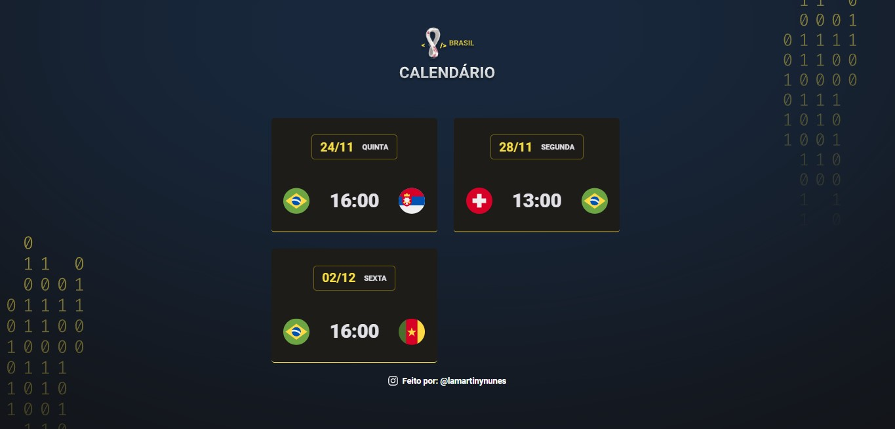

<h1 align="center"> calendário de Jogos - Brasil </h1>

Projeto Feito para acompanhamento de minha seleção na copa do mundo de 2022. &#127463;&#127479;

  <a href="#-tecnologias">Tecnologias</a>&nbsp;&nbsp;&nbsp;|&nbsp;&nbsp;&nbsp;
  <a href="#-projeto">Projeto</a>&nbsp;&nbsp;&nbsp;|&nbsp;&nbsp;&nbsp;
  <a href="#memo-licença">Licença</a>

  

 

  

## 🚀 Tecnologias

Esse projeto foi desenvolvido com as seguintes tecnologias:

- HTML e CSS
- JavaScript
- Git e Github

## 💻 Projeto

Projeto Feito para acompanhamento de minha seleção na copa do mundo de 2022.

## :memo: Licença

Esse projeto está sob a licença MIT.

---

Feito com ♥ by Lamartiny Nunes : [Instagran](https://www.instagram.com/lamartinynunes/) :  [Linkedin](https://www.linkedin.com/in/lamartiny-nunes/)
